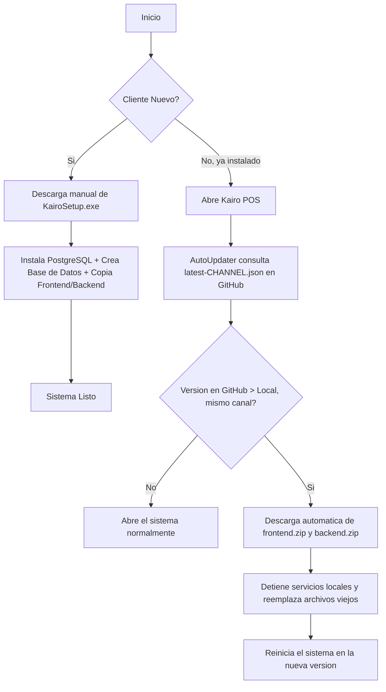

# Guía de Compilación y Publicación (Kairo POS)

Esta guía explica la arquitectura del sistema de instalación y actualización automática de **Kairo POS**, cómo funcionan los canales Alpha/Beta/Production, los archivos generados, cómo lanzar una nueva versión, y qué hacer cuando algo falla.

---

## 1. Arquitectura del sistema de actualización

El cliente instalado nunca consulta la API de GitHub Releases para buscar actualizaciones. Consulta un archivo de manifiesto commiteado en la rama `main` del repositorio, servido vía `raw.githubusercontent.com`:

```
https://raw.githubusercontent.com/esbanegas/kairo-desktop/main/installer/updates/latest-{channel}.json
```

**¿Por qué no usar la API de GitHub Releases directamente?** La API de GitHub sin autenticación tiene un límite de 60 solicitudes/hora **por IP**. Varias cajas POS de un mismo negocio suelen compartir la IP pública de su router — si todas consultaran la API directamente, podrían agotar ese límite entre sí y empezar a fallar la detección de actualizaciones de forma intermitente. `raw.githubusercontent.com` no tiene ese límite. Esta decisión ya fue evaluada y se mantiene.

El manifiesto sí referencia los assets reales (`KairoSetup.exe`, `frontend.zip`, `backend.zip`) alojados como adjuntos de un GitHub Release normal — solo el manifiesto en sí vive en `main`.

---

## 2. Los tres canales

| Canal | Audiencia | Formato de versión | Manifiesto |
| :--- | :--- | :--- | :--- |
| **Alpha** | Pruebas internas del equipo | `1.0.0-alpha.1`, `1.0.0-alpha.2`, ... | `latest-alpha.json` |
| **Beta** | Clientes/pilotos seleccionados | `1.0.0-beta.1`, `1.0.0-beta.2`, ... | `latest-beta.json` |
| **Production** | Todos los clientes reales | `1.0.0`, `1.0.1`, `1.1.0`, ... (sin sufijo) | `latest-production.json` |

**Aislamiento total entre canales**: un cliente instalado en un canal **solo** consulta el manifiesto de ese mismo canal — nunca hay una ruta de actualización cruzada (Alpha→Production, Beta→Alpha, etc.) salvo que se edite manualmente el `channel` en el `version.json` local de esa instalación (ver sección 9). El propio updater verifica en cada chequeo que `manifest.app.channel` coincida exactamente con el canal local; si no coincide, lo rechaza como error en vez de aplicarlo.

---

## 3. ¿Cómo funciona el flujo de Instalación vs Actualización?



El cliente que ya tiene la app instalada **solo descarga `frontend.zip` y `backend.zip`** (~30 MB en total) — no vuelve a descargar los 450+ MB del instalador completo.

> **Para instalar en una PC nueva, lee antes la [sección 12](#12-modelo-de-instalación-quién-ejecuta-el-setup-y-cuándo-se-eleva).** El Setup debe ejecutarlo, con doble clic normal, el usuario que va a operar el POS — de eso depende que las actualizaciones automáticas funcionen después.

---

## 4. Manual del desarrollador: cómo lanzar una nueva versión

Desde `kairo-desktop/installer`, ejecuta `publish.bat` (sin argumentos abre el menú interactivo):

```
============================================================
 KAIRO POS - Pipeline de Compilacion y Publicacion
============================================================
 Seleccione el canal:
  [1] Alpha
  [2] Beta
  [3] Production

Canal seleccionado: alpha

 Instalador ESTANDAR (~125 MB, descarga PostgreSQL solo si hace falta):
  [1] Compilar paquetes (--build-only)
  [2] Publicar Release a GitHub (--publish)
  [3] Compilar y Publicar todo (--all)

 Instalador OFFLINE (~482 MB, PostgreSQL embebido, sin Internet):
  [4] Compilar instalador offline (--build-only --offline)
  [5] Compilar y Publicar offline (--all --offline)

  [6] Verificar consistencia (solo lectura: manifest/tag/Release/assets)
  [7] Salir
```

> Los dos sabores son el mismo Kairo, misma versión y mismo canal. Ver [sección 13](#13-postgresql-como-dependencia-bajo-demanda).

También puede invocarse sin menús, para CI/scripts:
```
publish.bat --build-only alpha
publish.bat --publish     beta
publish.bat --all         production
publish.bat --verify      production
publish.bat --build-only alpha --offline
publish.bat --all        beta  --offline
```

Si el canal es **Production**, el paso de publicación pide una confirmación extra (S/N) antes de tocar GitHub — es el canal de mayor impacto.

### Receta: lanzar un Alpha
1. Asegúrate de que `acg-web` y `enlip-services` estén comiteados.
2. `publish.bat` → canal `Alpha` → `--all` (o `--build-only` y luego `--publish` por separado).
3. El número de versión (`-alpha.N`) se autoincrementa a partir de los tags existentes — no lo edites manualmente.

### Receta: lanzar un Beta
Igual que Alpha, seleccionando canal `Beta`. Los clientes Alpha o Production no verán este release.

### Receta: lanzar un Production
1. Edita `installer/version.json` y sube `"version"` a la base deseada (ej. `1.0.1`) — sin ningún sufijo.
2. `publish.bat` → canal `Production` → `--all`. Confirma el aviso de Production.
3. Corre `publish.bat --verify production` (o deja que el paso automático post-publish lo haga) para confirmar que el Release y los tres assets quedaron accesibles.

### ¿Qué hace `--build-only` internamente?
1. Resuelve la versión SemVer completa (`get-version.ps1`, valida el canal).
2. Compila Electron/Vite → `frontend.zip`; compila la API .NET → `backend.zip`.
3. Compila `KairoSetup.exe` con Inno Setup, con `/DAppChannel` y `/DAppVersion` resueltos.
4. Calcula SHA-256 y escribe `latest-{channel}.json`.
5. Escribe `output\build_version.txt` y `output\build_channel.txt` (usados por `--publish` para verificar que no se publique el canal equivocado).

### ¿Qué hace `--publish` internamente?
1. Si el canal es Production, pide confirmación.
2. Verifica que la compilación local (`build_channel.txt`) sea del mismo canal seleccionado — si no coincide, aborta **antes** de tocar git o GitHub.
3. Crea y empuja el tag `v{version}`.
4. Crea el Release en GitHub (`gh release create`) con los 4 assets.
5. Sincroniza (`git pull --rebase --autostash`), commitea y empuja `installer/updates/latest-{channel}.json` a `main`.
6. Corre automáticamente una verificación de consistencia (equivalente a `--verify`) y advierte si algo no cuadra — sin revertir nada, ya que el Release ya es real en ese punto.

Cada paso de git/gh (tag, push del tag, creación del Release, commit del manifiesto, push del manifiesto) verifica su propio código de salida y aborta con un mensaje explícito si falla — nunca se muestra "Publish Completado Exitosamente" si algo crítico falló a mitad de camino.

---

## 5. Requisitos para compilar

1. **Node.js y pnpm** (para `acg-web`).
2. **.NET 8 SDK** (para `ENLIPWebApi`).
3. **Inno Setup 6** (`C:\Users\<Usuario>\AppData\Local\Programs\Inno Setup 6\ISCC.exe`).
4. **GitHub CLI (`gh`)** autenticado (`gh auth login`).

---

## 6. Formato de versión y reglas por canal

- `get-version.ps1` valida que el canal sea exactamente `alpha`, `beta` o `production` — cualquier otro valor aborta con error (protección contra typos).
- **Alpha/Beta**: la versión base se toma de `version.json`, se le quita cualquier sufijo previo, y se le agrega `-{channel}.N`, donde `N` se autoincrementa consultando los tags existentes (`v{base}-{channel}.*`). Nunca hay que escribir el sufijo a mano.
- **Production**: la versión se publica tal cual (sin sufijo). Si `version.json` todavía tenía un sufijo de prerelease (ej. quedó en `1.0.0-alpha.5` de una prueba anterior), se descarta automáticamente y se imprime una advertencia — revisa esa advertencia antes de continuar si no la esperabas.
- El cliente instalado también valida esta relación: si su `version.json` dice `channel: "alpha"` pero `version` no tiene el formato `X.Y.Z-alpha.N` (o `channel: "production"` con un sufijo todavía presente), se considera una **instalación inconsistente**. Esto se registra como advertencia en `updater.log` al arrancar (no bloquea el arranque) y como **error real** la próxima vez que se intente comprobar actualizaciones (no se confunde con "no hay actualización").

---

## 7. Manifiesto de actualización (schema `kairo.update.manifest`)

```json
{
  "schema": "kairo.update.manifest",
  "schema_version": "1.0.0",
  "app": {
    "name": "Kairo POS",
    "version": "1.0.0-alpha.2",
    "channel": "alpha",
    "release_date": "2026-09-09T06:19:55Z"
  },
  "distribution": {
    "provider": "github_releases",
    "base_url": "https://github.com/esbanegas/kairo-desktop/releases/download/v1.0.0-alpha.2"
  },
  "files": {
    "installer": { "name": "KairoSetup.exe", "sha256": "..." },
    "frontend":  { "name": "frontend.zip",   "sha256": "..." },
    "backend":   { "name": "backend.zip",    "sha256": "..." }
  },
  "update_policy": {
    "mandatory": false,
    "min_supported_version": "1.0.0",
    "restart_required": true
  }
}
```

El updater construye la URL de descarga como `distribution.base_url + "/" + files.*.name` (nunca descarga el `base_url` a secas). Antes de aplicar una actualización, valida además que `app.channel` coincida con el canal local — si no coincide, la rechaza como error de tipo `channel_mismatch` en vez de aplicarla.

---

## 8. Qué hacer si el publish falla a mitad de camino

| Mensaje visto | Qué significa | Qué hacer |
| :--- | :--- | :--- |
| `La compilacion local ... fue hecha para el canal 'X' pero seleccionaste 'Y'` | Intentaste publicar con `--publish` un build viejo de otro canal | Nada se tocó en git/GitHub. Vuelve a correr `--build-only` con el canal correcto. |
| `Fallo la creacion del tag` / `Fallo el push del tag` | El tag no se pudo crear o subir | No se creó ningún Release. Revisa conectividad/permisos y reintenta `--publish`. |
| `Fallo la creacion de la release en GitHub` | El tag sí se subió pero `gh release create` falló | Revisa `gh auth status` y que los 4 archivos existan en `output\updates\{version}`. Puedes reintentar `--publish` (el tag ya existe, se detecta y se omite su creación). |
| `El release v... YA fue creado en GitHub, pero el manifiesto de actualizacion NO se ha publicado todavia` | El Release y assets ya están públicos, pero el `git commit`/`git push` del manifiesto falló | Los clientes no verán la actualización todavía (no es un problema urgente). Corre `--publish` de nuevo — detecta el Release existente y solo reintenta el paso del manifiesto. |
| `[ADVERTENCIA] La verificacion posterior al publish encontro inconsistencias` | El chequeo automático post-publish (`verify-manifest.ps1`) encontró algo raro | El Release ya se publicó, esto no lo revierte. Puede ser solo demora de propagación de `raw.githubusercontent.com` (unos minutos). Espera y corre `publish.bat --verify {channel}` de nuevo. Si persiste, ver sección 9. |

---

## 9. Qué hacer si un cliente reporta "no encuentra la actualización"

1. **Corre `publish.bat --verify {channel}` (o la opción de menú "Verificar consistencia")** — es de solo lectura, no publica ni borra nada. Confirma en un solo paso: que el manifiesto existe y tiene el schema correcto, que su `channel` coincide con el archivo, que el tag/Release de GitHub existen y no es un borrador, y que los 3 assets están realmente descargables con el SHA-256 correcto. Esto habría detectado en segundos el incidente descrito en la sección 10.
2. Pide al cliente el contenido completo de `version.json` en su carpeta de instalación (`version`, `channel`, `update_server`). Confirma que `channel` sea el esperado y que `version` tenga el formato correcto para ese canal (ver sección 6) — un mismatch aquí ahora se reporta como error explícito en el toast, no como "ya estás actualizado" silencioso.
3. Revisa `updater.log` en esa PC (`%ProgramData%\KairoPOS\logs\updater.log` para el proceso externo, y el log del proceso principal de Electron vía `app.getPath("userData")`) — busca la línea `Instalación inconsistente detectada` si la hay.
4. Prueba manualmente la URL exacta que el cliente consulta: `https://raw.githubusercontent.com/esbanegas/kairo-desktop/main/installer/updates/latest-{channel}.json` (agrega `?_nocache=<timestamp>` para evitar caché). Un 404 aquí significa que ese archivo nunca se publicó para ese canal, o que el canal local del cliente no es el que crees.
5. Descarta un bloqueo de red/proxy: `raw.githubusercontent.com` puede estar bloqueado en algunas redes corporativas.

---

## 10. Incidentes registrados

### 2026-09-09 — Releases y tags de `v1.0.0-alpha.1` y `v1.0.0-alpha.2` desaparecieron de GitHub

Durante una sesión de auditoría de este mismo sistema, se detectó que **ambos GitHub Releases (`v1.0.0-alpha.1`, `v1.0.0-alpha.2`) y sus tags dejaron de existir en el remoto** (confirmado vía `gh release list` vacío, la API pública `/repos/.../releases` y `/tags` devolviendo `[]`, y `git fetch --prune --prune-tags` eliminando los tags locales correspondientes). El archivo `installer/updates/latest-alpha.json` en `main` **no se vio afectado** (vive en el árbol de `main`, independiente de tags/Releases) y siguió anunciando `1.0.0-alpha.2` como disponible aunque sus assets ya no existían — exactamente el escenario que el `--verify`/`verify-manifest.ps1` de la sección 9 está pensado para detectar.

Se auditó todo el código de `publish.bat`, `build.bat`, `get-version.ps1`, `build-updater.bat`, `Program.cs` (kairo-updater) y el updater de `acg-web`: **ninguno contiene un comando destructivo de git/gh** (`release delete`, `tag -d`, `push --force`, `reset --hard`, etc.) ni invocaciones a git/gh fuera de las descritas en esta guía. La causa de la desaparición no se determinó (no se descartó una acción manual directa contra GitHub, fuera de este código). No se tomó ninguna acción correctiva automática sobre Releases/tags como parte de esta auditoría — se dejó constancia aquí y se esperó confirmación del equipo antes de volver a publicar.

**Lección aplicada**: se agregó `verify-manifest.ps1` (sección 9) como paso automático post-publish y como comando on-demand, precisamente para detectar esta clase de drift (manifiesto vs. Release/assets reales) apenas ocurra, en vez de descubrirlo cuando un cliente ya reportó el problema.

---

## 11. Testing

**Automatizado**: `pnpm test:version-compare` (en `acg-web`) corre `scripts/test-version-comparison.mjs`, que importa la función real de comparación (`src/updater/versionCompare.js`, sin dependencias de Electron) y verifica la matriz completa: `alpha.2 < alpha.10` (numérico, no de string), `alpha < beta < production` en la misma `X.Y.Z`, no-downgrade en ambas direcciones, misma versión/canal → no hay actualización.

**Modelo de instalación**: `powershell -ExecutionPolicy Bypass -File installer\test-install-model.ps1` — compila el instalador y verifica que siga cumpliendo los tres requisitos de la sección 12 (el Setup no se auto-eleva, `{app}` es escribible sin UAC, PostgreSQL no se lanza desde `[Run]`, los accesos directos son per-user, `[Dirs]` no reescribe ACLs y `kairo-updater.exe` se instala sin `Check` condicional). Incluye la comprobación definitiva: que el manifiesto del `Setup.exe` generado declare `asInvoker`. Con `-SkipCompile` verifica solo el texto del `.iss`, para runners sin Inno Setup.

**Solo lectura, contra GitHub real**: `publish.bat --verify {channel}` (o `verify-manifest.ps1 -channel {channel}` directamente) — confirma consistencia manifest/tag/Release/assets sin publicar ni modificar nada.

**Manual** (requieren un build real o `dev-test-updates.bat`):
- Alpha.1→Alpha.2 y Beta.1→Beta.2 de punta a punta (detectar → banner → descargar → verificar SHA-256 → aplicar → reiniciar).
- Production→Alpha y Alpha→Production NO deben actualizar (probar sirviendo un manifiesto con `app.channel` que no coincida con el canal solicitado; debe rechazarse con error `channel_mismatch`, sin crashear).
- Asset faltante → error limpio (`not_found`), sin aplicar nada.
- SHA-256 incorrecto → `checksum_mismatch`, `kairo-updater.exe` nunca se lanza.
- Sin internet → error `network` amigable en el chequeo manual; el chequeo silencioso de fondo (30s al arrancar) solo logea, no rompe la app.
- `dev-test-updates.bat 1.0.1 skip alpha` (o `beta`) levanta un servidor local con el schema de manifiesto correcto para probar todo el flujo sin tocar GitHub.

---

## 12. Modelo de instalación: quién ejecuta el Setup y cuándo se eleva

Kairo se instala **por usuario**, en `%LocalAppData%\Programs\KAIRO POs`, no en Program Files. Esa es la condición para que el auto-updater pueda reemplazar `app.asar` y `api\*` sin pedir UAC en cada actualización.

### Regla principal

> **El Setup se ejecuta como el usuario que va a operar el POS — nunca con "Ejecutar como administrador".**

Si se ejecuta elevado, `%LocalAppData%`, el escritorio, el menú Inicio y la entrada de desinstalación resuelven al perfil de **la cuenta que dio las credenciales UAC** (el supervisor o técnico), no al del cajero. Kairo quedaría instalado en un perfil al que el operador no tiene acceso.

Si el instalador detecta que se está ejecutando elevado, **avisa y muestra la ruta exacta donde instalará**, para que quien esté frente a la pantalla confirme o cancele. No lo bloquea: un administrador instalando para sí mismo está en el caso correcto, y en una PC con UAC deshabilitado cualquier administrador corre siempre elevado.

### Escenario soportado: cajero estándar + supervisor administrador

1. Inicia sesión en Windows **el cajero** (puede ser una cuenta estándar, sin privilegios).
2. El cajero ejecuta `KairoSetup.exe` con doble clic normal.
3. Cuando el instalador necesita privilegios, aparece el UAC y **el supervisor teclea sus credenciales** en ese momento.
4. Kairo queda instalado en el perfil del cajero; PostgreSQL y la regla de firewall quedan a nivel de máquina.

### Cuándo aparece el UAC

Solo dos operaciones de toda la instalación requieren privilegios:

| Operación | Cuándo aparece |
|---|---|
| Instalar PostgreSQL | Solo si no hay PostgreSQL ya instalado en la máquina |
| Abrir el puerto 8855 en el firewall | Solo en modo **Servidor**, y solo si la regla no existe |

Consecuencias prácticas:

- **Modo Cliente → cero prompts de UAC.** No instala PostgreSQL ni toca el firewall.
- **Modo Standalone en una PC que ya tiene PostgreSQL → cero prompts de UAC.**
- **Modo Servidor sobre una PC limpia → dos prompts** (uno por operación). No se agrupan en uno solo a propósito: agruparlos obligaría a pasar la contraseña del superusuario de PostgreSQL a través de `cmd.exe`, donde caracteres como `"`, `&`, `^` o `%` se interpretan y romperían la instalación.

Si el supervisor **cancela** el UAC de PostgreSQL, la instalación de Kairo se completa igual y avisa que falta PostgreSQL. Queda recuperable: instálalo aparte y Kairo funcionará, o vuelve a ejecutar el instalador con un administrador disponible.

### Instalaciones anteriores (alpha.8 y previas)

Las versiones hasta `alpha.8` usaban el modelo viejo (Setup elevado), y registraban la desinstalación en `HKLM`. El instalador nuevo detecta esa entrada y **se detiene** pidiendo desinstalar primero. No hay actualización en sitio entre los dos modelos.

Al desinstalar **no se pierden datos**: la base de datos y `C:\ProgramData\KairoPOS` no se tocan.

Justamente porque `C:\ProgramData\KairoPOS` sobrevive, el instalador nuevo **no intenta reescribir sus permisos**. Esa carpeta fue creada por el Setup elevado de alpha.8, así que pertenece a la cuenta administradora y un usuario estándar no puede cambiar su ACL. No hace falta hacerlo: el instalador viejo ya le había dado permiso de modificación a todos los usuarios, así que el cajero puede escribir ahí. En una instalación limpia, el cajero crea la carpeta y queda como propietario. Los dos caminos funcionan sin tocar ningún permiso ni borrar nada.

Si además quedó un `admin_credentials.txt` de alpha.8 (con permisos restringidos a Administradores), el instalador nuevo no puede sobrescribirlo y tampoco lo borra: escribe las credenciales junto a la aplicación, en `%LocalAppData%\Programs\KAIRO POsdmin_credentials.txt`, y lo registra en el log.

---

## 13. PostgreSQL como dependencia bajo demanda

Desde esta versión, `KairoSetup.exe` **no embebe PostgreSQL**. El instalador pasó de ~482 MB a ~125 MB y PostgreSQL se descarga solo cuando hace falta.

### Los dos sabores

| | Tamaño | Internet | PostgreSQL |
|---|---|---|---|
| `KairoSetup.exe` | ~125 MB | Solo si hay que descargar PG | Bajo demanda |
| `KairoSetup-Offline.exe` | ~482 MB | No necesario | Embebido |

**Ambos producen exactamente la misma instalación de Kairo y usan el mismo sistema de actualizaciones.** El sabor offline **no** es una versión distinta: misma versión, mismo canal, mismo `frontend.zip` y `backend.zip`. Lo único que cambia es de dónde sale el instalador de PostgreSQL.

### El release de dependencias

PostgreSQL vive en un release aparte, de larga vida, que **no se vuelve a subir en cada build**:

```bash
gh release create deps-postgresql-17 \
  "installer/assets/postgresql_installer.exe" \
  --title "Dependencias: PostgreSQL 17" \
  --notes "Instalador de PostgreSQL 17 usado por KairoSetup.exe bajo demanda." \
  --latest=false
```

El `--latest=false` evita que GitHub lo marque como "Latest release" y confunda a quien busca Kairo.

La URL y el hash están fijados como defines en `enlip_setup.iss` y se pueden sobreescribir sin tocar el archivo:

```
/DPostgresUrl="https://..." /DPostgresSha256="<64 hex>"
```

**La versión está fijada a propósito.** Nada de "latest PostgreSQL": un cambio de versión río arriba no debe alterar en silencio lo que se instala en las cajas.

### Cómo compilar cada sabor

Desde el menú de `publish.bat`, tras elegir el canal:

```
Instalador ESTANDAR (~125 MB, descarga PostgreSQL solo si hace falta):
 [1] Compilar paquetes          [2] Publicar          [3] Compilar y Publicar

Instalador OFFLINE (~482 MB, PostgreSQL embebido, sin Internet):
 [4] Compilar instalador offline    [5] Compilar y Publicar offline
```

O sin menú, con `--offline` como modificador:

```
publish.bat --build-only alpha --offline
publish.bat --all       beta  --offline
```

El build estándar **compila sin necesidad de que `postgresql_installer.exe` exista en disco**, lo que permite builds limpios en CI (el archivo está en `.gitignore`). El build offline sí lo exige y falla en tiempo de compilación si falta.

### Qué ve el usuario al instalar

Hay una página nueva, **Conexión con PostgreSQL**, antes del resumen final:

- **Si PostgreSQL ya está instalado**: muestra la instancia real detectada — versión, ubicación, servicio y puerto leído de `postgresql.conf`. Host, puerto, usuario y contraseña son editables, y hay un botón **Probar conexión**. No se reinstala nada.
- **Si no está**: ofrece **Descargar e instalar** (con progreso en MB, cancelable y verificación SHA-256) o **Continuar sin PostgreSQL**, que avisa claramente que la instalación no queda lista para usarse.

**No se puede avanzar sin una conexión probada**, salvo que se elija explícitamente continuar sin PostgreSQL. Antes, una contraseña mal tecleada pasaba desapercibida y fallaba recién al abrir Kairo por primera vez, con un error incomprensible.

Excepción: si falta `psql.exe` (el componente *Command Line Tools* del instalador de EDB es desmarcable), no se puede verificar; se avisa y se deja continuar, porque bloquear por una herramienta ausente sería peor que el problema.

### Detección multi-instancia

La detección ya no asume `localhost:5432`. Lee del registro la versión y la ubicación, confirma el servicio de Windows contra `HKLM\SYSTEM\CurrentControlSet\Services`, y obtiene el puerto de `postgresql.conf`.

Esto importa en equipos con varias instancias — por ejemplo PostgreSQL 16 en 5432 y 17 en 5433. Antes, el modo automático escribía `5432` cableado en `appsettings.json` y podía apuntar a la instancia equivocada.

Si el directorio de datos no es legible (suele estar restringido al servicio y a Administradores, y el Setup corre como usuario estándar), el puerto queda en 5432 y se marca como no verificado. Por eso el campo es editable y la verdad final la da **Probar conexión**, no la detección.

### Seguridad de la contraseña

`PGPASSWORD` se pasa por **variable de entorno del proceso**, nunca por línea de comandos: los argumentos de un proceso son visibles para cualquier usuario de la máquina y acabarían en logs. Se limpia siempre después de usarse y no se escribe a disco.

El instalador descargado **no se ejecuta si el SHA-256 no coincide**.

### El updater no cambia

PostgreSQL **no participa en las actualizaciones**. El updater sigue descargando solo `frontend.zip` y `backend.zip`, e ignora la entrada `installer` del manifiesto. Una máquina instalada con el sabor estándar y otra con el offline se actualizan exactamente igual.
